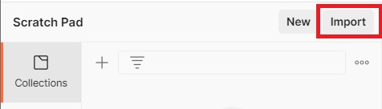
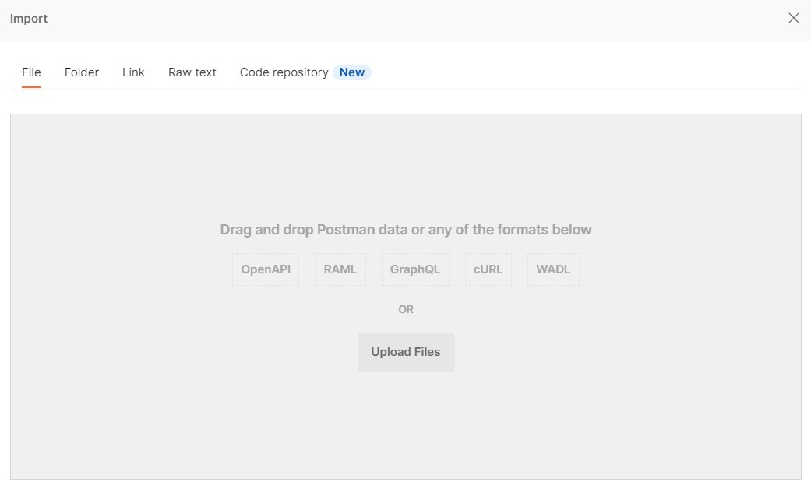
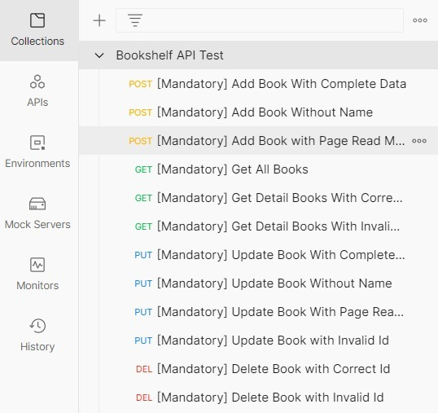
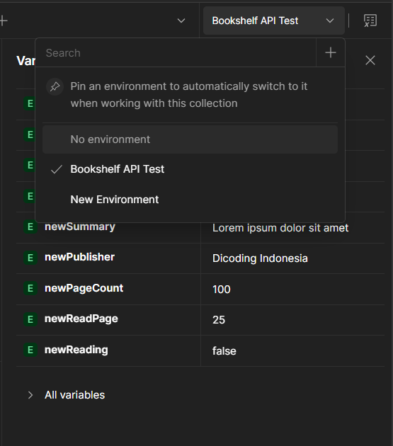
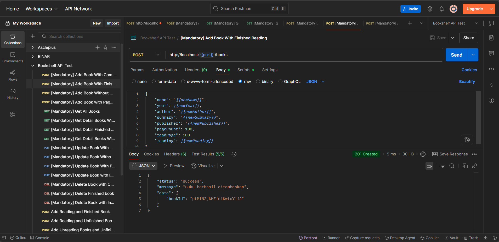
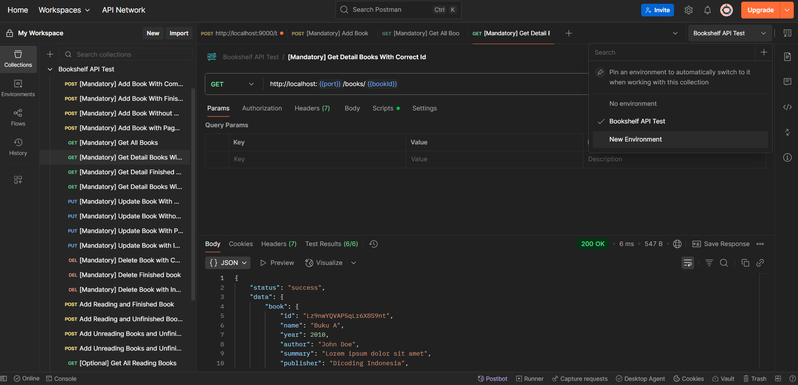

# 📦 Cara Import Koleksi dan Environment di Postman

Untuk menjalankan pengujian API ini menggunakan **Postman**, Anda perlu mengimpor **dua berkas JSON**: Collection dan Environment.

---

## 📥 Langkah-Langkah

1. **Ekstrak berkas ZIP yang telah Anda unduh**, hingga menghasilkan dua file `.json` (Collection & Environment).

2. Buka aplikasi **Postman**, kemudian klik tombol **Import** yang berada di pojok kiri atas.
   

3. Klik tombol **Upload Files**, lalu pilih kedua file JSON yang telah diekstrak.

   

4. Setelah itu, Postman akan menambahkan keduanya ke dalam workspace Anda.

   - **Bookshelf API Test Collection:**

     

   - **Environment:**

     

---

## ✅ Hasil Setelah Import

- **penggunaan:**

---

